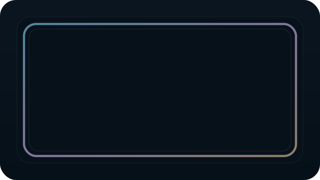
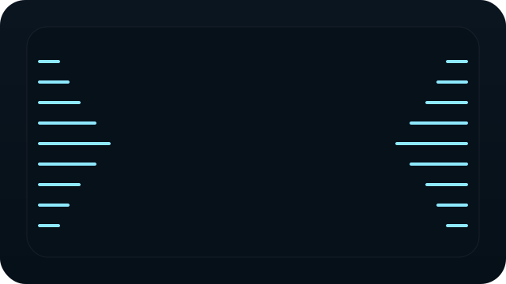
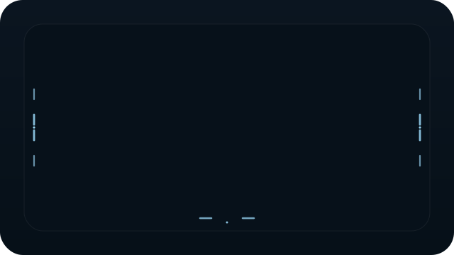



<h1 style="font-size: 64px; letter-spacing: 2px;">Paraline</h1>

### *A desktop audio visualizer that turns your screen edges into motion.*

Paraline is a Windows desktop visualizer that lives directly on your screen —  
not inside a music player, not trapped in a window, but woven into the desktop itself.

It transforms system audio into ambient waves, reactive borders, and flowing light around your display, built to feel atmospheric, polished, and comfortable enough to leave running for hours.

---

## ✦ Preview

<table>
<tr>
<td align="center" width="33%">
<strong>Ambient Wave</strong> 

</td>
<td align="center" width="33%">
<strong>Reactive Border</strong> 

</td>
<td align="center" width="33%">
<strong>Flow Border</strong> 

</td>
</tr>
<tr>
<td align="center" width="33%">
<strong>Side Bars</strong> 

</td>
<td align="center" width="33%">
<strong>Pulse Lines</strong> 

</td>
<td align="center" width="33%">
<strong>Dot Particles</strong> 

</td>
</tr>
<tr>
<td></td>
<td align="center" width="33%">
<strong>Ripple Flow</strong> 

</td>
<td></td>
</tr>
</table>

---

## ✦ Installation

1. Download the latest **Paraline** release
2. Run the `.exe` installer
3. Launch the app
4. Open the **system tray** to control themes and settings

Once started, Paraline runs as a transparent desktop overlay and reacts in real time to the audio playing through your current output device.

---

## ✦ The Idea

Most visualizers are designed to **grab attention**.

Paraline was built to do something more interesting:

> make the desktop feel alive without making it feel loud.

Instead of sitting in a separate player window, Paraline becomes part of the screen itself — subtle when it should be subtle, expressive when it needs to be expressive, and always shaped around the audio currently playing on your system.

It is less about showing sound as a spectacle,  
and more about turning sound into atmosphere.

---

## ✦ Why Paraline Feels Different

<table>
<tr>
<td>

### Traditional Visualizers
- live inside a player window  
- feel flashy and temporary  
- compete with the desktop  
- are often too loud visually  

</td>
<td>

### Paraline
- lives directly on the desktop  
- feels calm, architectural, and ambient  
- blends into your workspace  
- is built for cont. background use  

</td>
</tr>
</table>

---

## ✦ Core Features

### 🎧 Real Audio, Not a Demo Loop
Paraline reacts to **actual Windows system audio** using WASAPI loopback capture, so the visuals respond to whatever is really playing on your machine.

### 🖥️ Desktop-Native Overlay
The app runs as a **transparent, always-on-top, click-through overlay**, so the effect feels embedded into the screen instead of floating above your workflow.

### 🎨 Multiple Visual Styles
Paraline includes multiple themes, each built with its own visual identity and its own settings, so the experience can shift from subtle to expressive without feeling messy.

### ⚙️ Tray-Based Control
The visualizer stays lightweight and out of the way, with controls available directly from the **system tray**.

### 💾 Theme-Specific Settings
Each theme remembers its own configuration, so switching styles does not destroy your previous setup.

### 🚀 Optimized for Long Sessions
Paraline is designed to stay running in the background without feeling heavy or distracting.

---

## ✦ Themes

<table>
<tr>
<th align="left">Theme</th>
<th align="left">Style</th>
<th align="left">Controls</th>
</tr>
<tr>
<td><strong>Ambient Wave</strong></td>
<td>Soft ambient edge waves for minimal desktop motion.</td>
<td>Tone, edge mode, sensitivity, glow strength</td>
</tr>
<tr>
<td><strong>Reactive Border</strong></td>
<td>Full-border audio-reactive glow with stronger presence.</td>
<td>Color style, intensity, border thickness, glow strength</td>
</tr>
<tr>
<td><strong>Flow Border</strong></td>
<td>Directional light motion traveling around the screen perimeter.</td>
<td>Direction, speed mode, segment length, glow strength, color style</td>
</tr>
<tr>
<td><strong>Side Bars</strong></td>
<td>Left-right edge bars with centered musical emphasis.</td>
<td>Color style, bar thickness, sensitivity, bar count</td>
</tr>
<tr>
<td><strong>Pulse Lines</strong></td>
<td>Center-origin pulse motion locked to the screen edges.</td>
<td>Mode, intensity, speed, color</td>
</tr>
<tr>
<td><strong>Dot Particles</strong></td>
<td>Full-border dot motion with beat-reactive energy and direction changes.</td>
<td>Density, motion style, direction behavior, glow strength</td>
</tr>
<tr>
<td><strong>Ripple Flow</strong></td>
<td>Symmetric edge wavefronts expanding outward from a center origin.</td>
<td>Mode, intensity, sensitivity, color</td>
</tr>
</table>

---

## ✦ Experience

Paraline is built for a very specific feeling:

- the desktop should stay usable  
- the visuals should stay elegant  
- the sound should feel present  
- the effect should feel like part of the OS  

That balance is the whole point.

You can leave it running while:
- working
- coding
- studying
- listening casually
- sitting in a dark room with music on and nothing else open

And it should still feel good.

---

## ✦ Usage

## Tray Controls

Paraline is designed to stay visually present but operationally invisible.

From the tray, you can:

- pause or resume the visualizer
- switch between themes
- open theme-specific settings
- change each theme’s behavior independently
- quit the app cleanly

---

## Theme-Specific Settings

Each theme owns its own settings.

That means you can keep:

- **Ambient Wave** soft and minimal  
- **Reactive Border** brighter and more intense  
- **Flow Border** smoother and more directional  

Switching themes does **not** wipe the others.

Your setup stays remembered the way you left it.

---

## ✦ Built With

Paraline combines desktop UI rendering with native Windows audio capture.

- **Electron** — desktop shell and overlay window
- **Node.js** — app/runtime logic
- **Canvas-based rendering** — visual output and animation
- **C# helper process** — Windows audio capture layer
- **WASAPI loopback** — real-time system audio input

---

## ✦ Why This Project Exists

Most audio visualizers fall into one of three extremes:

- too flashy  
- too gimmicky  
- too disconnected from the desktop  

Paraline started from a different question:

> what if a visualizer felt less like an app, and more like a part of the screen?

The goal was not just to make sound visible,  
but to make the desktop itself feel more alive —  
more atmospheric, more intentional, and more beautiful to sit in.

---

## ✦ Roadmap

- multi-monitor support  
- more theme presets  
- smoother startup and background behavior  
- deeper theme-specific controls  
- better packaging and release polish  
- more refined motion systems  

---

## ✦ Developer Notes

If you want to explore the implementation details, local setup, or development workflow:

**[Open Developer Notes](./docs/DEVELOPMENT.md)**

---

### Paraline is not a media player visualizer.

It is a layer of motion for the desktop itself.

