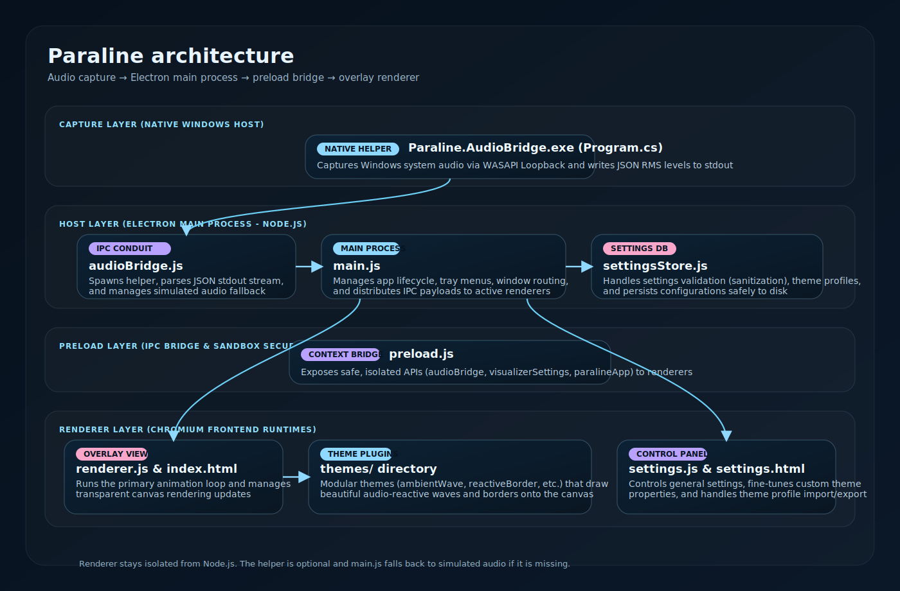
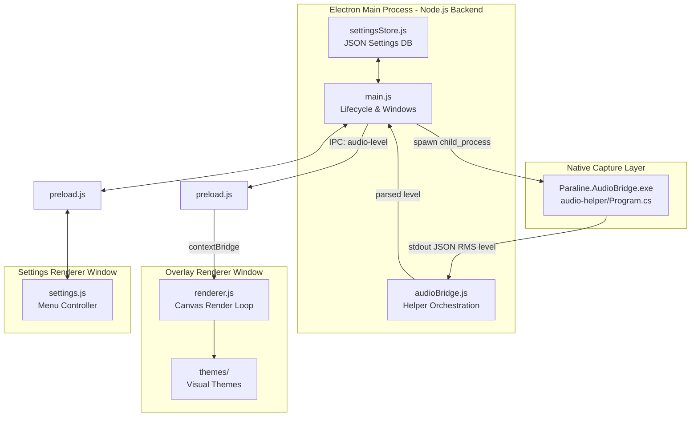

# Paraline Architecture

This file is for new contributors. It shows how audio moves from the native helper into the Electron app and out to the overlay renderer.

Paraline is a flat JavaScript app at the root of the repo. The core pieces live in `main.js`, `renderer.js`, `preload.js`, `audioBridge.js`, and `settingsStore.js`.

## Flow

1. The Electron main process in `main.js` starts the overlay window, settings window, tray, and audio bridge. (Note: There is no separate tray module, it is built directly in `main.js`).
2. The native helper in `audio-helper/Program.cs` captures system loopback audio on Windows and writes one JSON line per level sample to stdout.
3. The helper outputs a simple RMS amplitude scalar between 0 and 1. It does not calculate FFT bands or spectrum data.
4. The backend module `audioBridge.js` spawned in the main process parses this stdout JSON stream and forwards the level events to `main.js`.
5. The preload bridge in `preload.js` exposes a secure, sandboxed context API to the renderer windows without exposing Node.js itself.
6. The overlay renderer in `renderer.js` receives live audio levels and distributes them to the active theme in `themes/` to draw the edge visualizer onto a full-screen transparent canvas.
7. The settings window and backend settings store keep user preferences, profiles, and startup behavior in sync.

---

## Layers

### 1. Native Capture Layer
Captures system audio with WASAPI loopback and prints compact JSON records to stdout. The output is a plain RMS level, not FFT or spectrum data.

Key files:
- [audio-helper/Program.cs](audio-helper/Program.cs)
- [audio-helper/Paraline.AudioBridge.csproj](audio-helper/Paraline.AudioBridge.csproj)

### 2. Desktop Host Layer (Electron Main &amp; Node.js Backend)
Owns the application lifecycle, tray actions, window routing, settings persistence, and native helper process management.

Key files:
- [main.js](main.js) — The application entry point (handles windows, tray, IPC routing)
- [audioBridge.js](audioBridge.js) — Spawns the C# child process, parses stdout, and manages simulated audio fallback
- [settingsStore.js](settingsStore.js) — Persists user preferences, handles sanitization/validation, and manages theme profiles

### 3. Preload Layer (IPC Security Boundary)
Exposes only the explicit, safe APIs the renderers need and keeps Node.js out of the Chromium renderer processes.

Key file:
- [preload.js](preload.js) — Injects `audioBridge`, `visualizerSettings`, and `paralineApp` namespaces into the global window context

### 4. Renderer Layer (Chromium Frontend Renders)
Renders the overlay visualizer and the settings controller windows. Both windows run in separate sandboxed renderer contexts.

Key files:
- [index.html](index.html) &amp; [renderer.js](renderer.js) — Full-screen canvas overlay executing the primary render loop
- [themes/](themes/) — Modular theme plugins (e.g., `ambientWave.js`, `reactiveBorder.js`, `flowBorder.js`)
- [settings.html](settings.html) &amp; [settings.js](settings.js) — Interactive settings UI panel and profiles customizer
- Landing preview components: [EdgePulseFrame.jsx](landing/src/components/EdgePulseFrame.jsx), [PreviewStage.jsx](landing/src/components/previews/PreviewStage.jsx)

---

## Mermaid Source

---

## Getting Oriented as a New Contributor

1. Start with [docs/DEVELOPMENT.md](docs/DEVELOPMENT.md) for local setup, helper build steps, and running the app.
2. The main backend entry points are [main.js](main.js), [audioBridge.js](audioBridge.js), and [settingsStore.js](settingsStore.js).
3. The secure bridge lives in [preload.js](preload.js).
4. The visualizer rendering entry point is [renderer.js](renderer.js) which loads visual themes from the [themes/](themes/) folder.
5. Frontend theme preview components (for the product site) are in the [landing/](landing/) project.
6. Audio capture is in [audio-helper/Program.cs](audio-helper/Program.cs), and it emits a single RMS level per update. There is no FFT or spectrum path.
7. The tray is built directly in [main.js](main.js). There is no separate tray module to find or edit.
